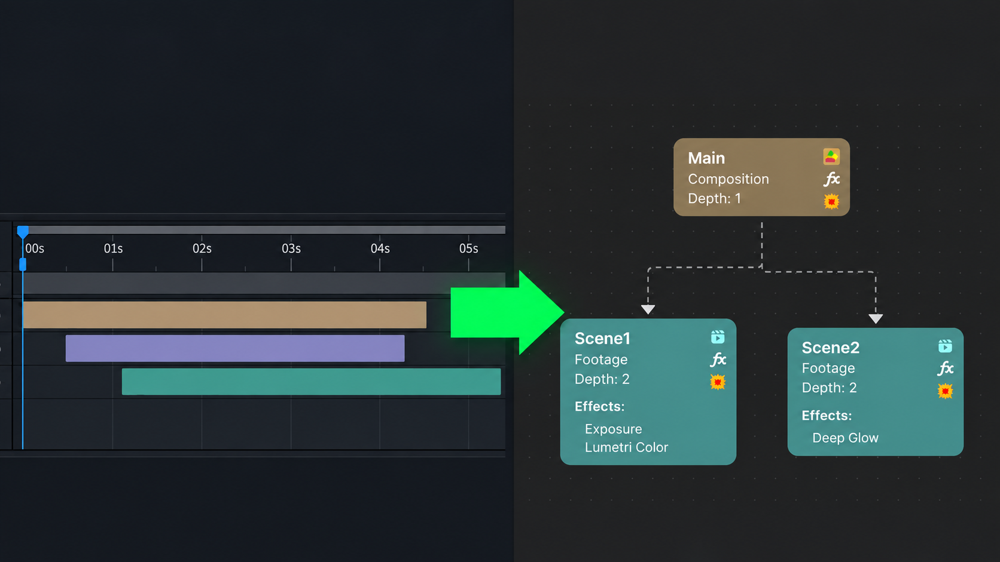
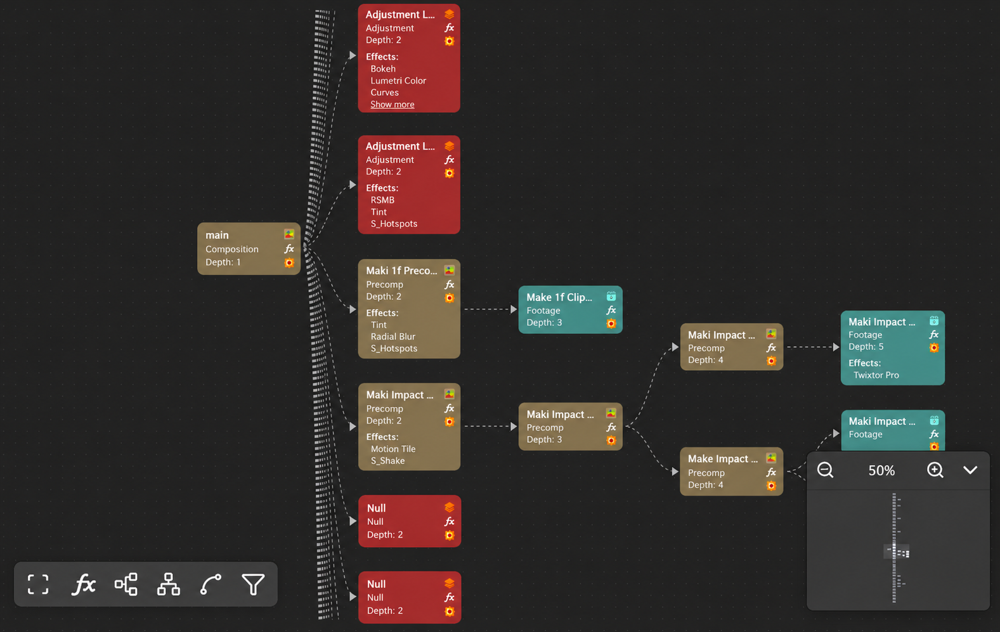
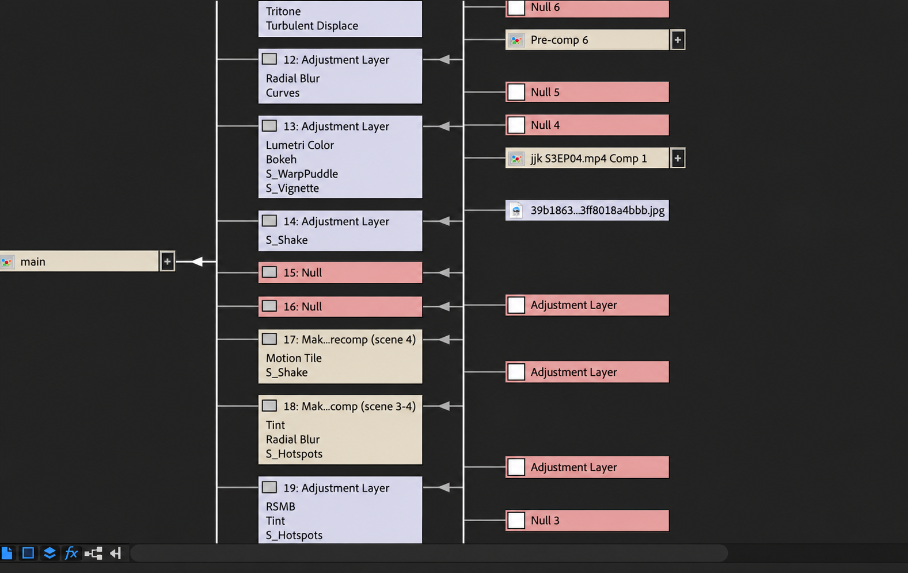

<p align="center">
  
</p>

<p align="center">
  A graph-based project explorer for Adobe After Effects.
</p>

<div align="center">

[](https://github.com/OnlyNati05/X-Ray/releases)
[](https://www.youtube.com/watch?v=-5BqoSxddzk)
[](LICENSE)

</div>

<p align="center">
  
</p>

## Table of Contents

- [Overview](#overview)
- [Getting Started](#getting-started)
  - [Requirements](#requirements)
  - [Installation](#installation)
  - [Usage](#usage)
- [Tech Stack](#tech-stack)
- [Project Structure](#project-structure)
- [Current Limitations](#current-limitations)
- [Found a Bug?](#found-a-bug)

## Overview

X-Ray is a graph-based visualization tool for Adobe After Effects. Starting
from the active composition, it maps the surrounding composition hierarchy and
represents compositions, precompositions, footage, and layers as connected
nodes. The resulting graph makes it easier to inspect how elements flow through
a complex composition network.

After Effects includes a native
[Flowchart panel](https://helpx.adobe.com/after-effects/desktop/work-with-projects/after-effects-projects/projects.html),
but X-Ray provides a different workflow focused on interactive exploration and
dependency analysis:

| Capability               | X-Ray                                                             | After Effects Flowchart                                                      |
| ------------------------ | ----------------------------------------------------------------- | ---------------------------------------------------------------------------- |
| Interactive graph canvas | Pan, dedicated zoom controls, fit-to-view controls, and a minimap | Cannot zoom in and out, only native panel navigation and appearance controls |
| Depth                    | Calculate how deeply nested each layer is within a composition    | Does not provide depth information                                           |
| Effect filtering         | Filter the graph by one or more applied effects                   | No effect-based node filtering workflow                                      |
| Blast Radius             | Trace the ancestor compositions that depend on a selected node    | No dedicated dependency-impact view                                          |

| X-Ray                                            | After Effects Flowchart                                                 |
| ------------------------------------------------ | ----------------------------------------------------------------------- |
|  |  |

## Getting Started

### Requirements

- Adobe After Effects 2024 or newer

Earlier versions of After Effects have not been tested and are not currently
supported.

### Installation

1. Open the repository's
   [Releases](https://github.com/OnlyNati05/X-Ray/releases) page.
2. Open the most recent release and download its `.zxp` file.
3. Install a compatible ZXP installer, such as
   [aescripts ZXP Installer](https://aescripts.com/learn/zxp-installer/).
4. Open the installer and select the downloaded `.zxp` file.
5. Follow the installer prompts to install X-Ray.
6. Restart After Effects if it is currently running.
7. In After Effects, open **Window → Extensions → X-Ray**.

### Usage

1. Open Adobe After Effects and load your project.
2. Select a composition in your project.
3. Navigate to **Window → Extensions → X-Ray** to open the panel.
4. Explore the flowchart to inspect nested compositions, footage, effects, and layer depth.

For a full demonstration, watch the [Demo Video](https://www.youtube.com/watch?v=-5BqoSxddzk).

## Tech Stack

| Technology                   | Role                                                                                     |
| ---------------------------- | ---------------------------------------------------------------------------------------- |
| Adobe CEP                    | Hosts X-Ray as a dockable After Effects extension panel                                  |
| ExtendScript                 | Reads compositions, layers, relationships, and applied effects from After Effects        |
| Bolt CEP / `vite-cep-plugin` | Connects the CEP frontend to ExtendScript and handles development, builds, and packaging |
| React                        | Builds the panel interface and interactive controls                                      |
| TypeScript                   | Provides shared, type-safe graph models across the frontend and ExtendScript code        |
| React Flow (`@xyflow/react`) | Renders the interactive node-and-edge graph                                              |
| Dagre                        | Calculates automatic vertical and horizontal graph layouts                               |
| Vite                         | Bundles the CEP frontend and development environment                                     |
| Sass                         | Styles graph nodes, controls, menus, and the panel interface                             |

## Project Structure

```text
X-Ray/
├── .github/workflows/       # Automated release builds
├── docs/                    # Documentation and assets
├── src/
│   ├── js/                  # React frontend (CEP panel)
│   │   ├── components/
│   │   ├── lib/
│   │   ├── main/
│   │   └── utils/
│   ├── jsx/                 # ExtendScript backend (After Effects)
│   │   ├── aeft/
│   │   └── index.ts
│   └── shared/              # Shared TypeScript types
├── cep.config.ts            # CEP configuration
├── vite.config.ts           # Frontend build configuration
├── vite.es.config.ts        # ExtendScript build configuration
└── package.json
```

The After Effects side discovers the active composition network and constructs
the graph under `src/jsx/aeft`. Bolt's `evalTS()` bridge sends that graph to the
React frontend, where React Flow renders it and Dagre calculates its layout.
Shared graph interfaces in `src/shared` keep both sides type-safe.

The generated extension is written to `dist/cep`. Build output and the generated
CSXS manifest should not be edited manually.

## Current Limitations

X-Ray is currently a read-only visualization tool and does not replace every
feature of the native Flowchart panel:

- It does not display every item in the After Effects Project panel.
- It does not currently track arbitrary references from layer properties or
  effects to items in the Project panel.
- Selecting a node does not reveal or select its corresponding layer or
  composition in After Effects.
- Nodes cannot be used to modify or delete elements in the After Effects
  project.

These capabilities are potential areas for future development.

## Found a Bug?

Found a bug or have a feature request? Open an issue through the repository's
[GitHub Issues](https://github.com/OnlyNati05/X-Ray/issues) page.
